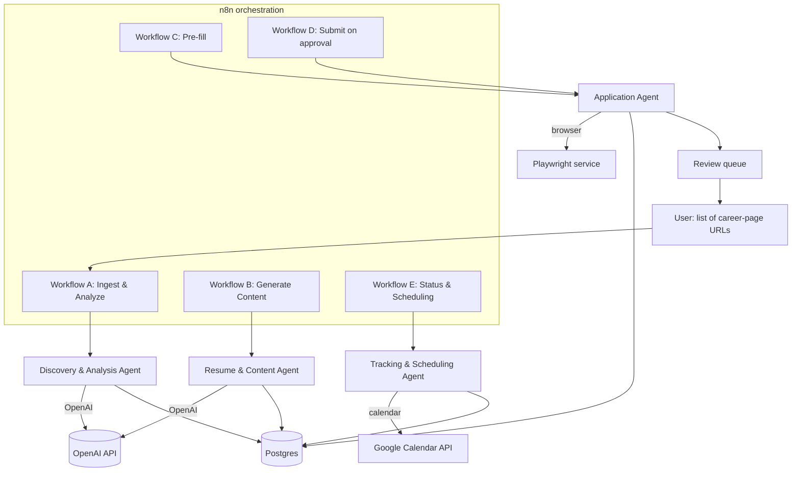

# JobAgent, Technical Architecture

**Version:** 0.1 (draft)
**Status:** Read after PRD.md. Defines how the system is built.
**Last updated:** 2026-08-04

---

## 1. Overview

JobAgent is four logical agents coordinated by n8n, with OpenAI as the reasoning layer and a Playwright service handling browser work. Each "agent" is a role, implemented as one or more OpenAI calls with a dedicated system prompt (plus, for the Application Agent, the Playwright service). n8n owns control flow, scheduling, retries, and glue. OpenAI owns reasoning. The two never blur: n8n decides *when* and *in what order*, OpenAI decides *what the content should be*.

## 2. The four agents

### 2.1 Discovery and Analysis Agent
- **Input:** one or more career-page URLs (Greenhouse / Lever / Workday).
- **Work:** fetch the page (via the Playwright service for JS-rendered pages), extract JD text, then OpenAI parses it into structured requirements and a ranked keyword list, and scores fit against the master Profile.
- **Output:** a `Job` record with `requirements`, `keywords`, `fit_score`, `raw_jd`. Low-fit jobs are flagged and dropped from the pipeline.
- **Tools:** Playwright service (fetch/render), OpenAI.

### 2.2 Resume and Content Agent
- **Input:** a qualifying `Job` + the master `Profile`.
- **Work:** OpenAI tailors resume content to the job's keywords under a strict no-fabrication rule (rephrase and reorder only), then generates a role-specific cover letter referencing the company and title.
- **Output:** a `ResumeVariant` and a `CoverLetter` linked to the job.
- **Tools:** OpenAI.

### 2.3 Application Agent
- **Input:** `Job` + `ResumeVariant` + `CoverLetter` + Profile contact fields.
- **Work:** Playwright navigates the career page, maps and fills standard fields, uploads the resume, and **stops before submit**. Captures a screenshot and a field map as the review artifact.
- **Output:** a pre-filled application in state `pending_review`, plus the review artifact.
- **On approval (Workflow D):** the same agent completes submission and marks `submitted`.
- **Tools:** Playwright service.

### 2.4 Tracking and Scheduling Agent
- **Input:** application lifecycle events and status updates.
- **Work:** writes and updates status in Postgres. On a confirmed interview, creates a Google Calendar event.
- **Output:** updated `Application`, an `Interview` record with `calendar_event_id`.
- **Tools:** Postgres, Google Calendar API.

## 3. Orchestration (n8n)

Five workflows, each triggerable and independently retryable:

- **A, Ingest & Analyze:** trigger on new URLs, runs the Discovery Agent, writes `Job` records.
- **B, Generate Content:** trigger on a qualifying job, runs the Resume & Content Agent.
- **C, Pre-fill:** trigger on content-ready, runs the Application Agent, pushes to the review queue.
- **D, Submit on approval:** trigger on user approval, completes submission, kicks Tracking.
- **E, Status & Scheduling:** periodic or event-driven status sync and interview scheduling.

n8n handles retries, backoff, and rate limiting so the 50+/week volume respects portal limits.

## 4. Data model

Store: **managed Postgres (Neon).** Decision locked.

Core entities:
- **Profile:** the master resume/profile (canonical source of content). One per user.
- **Job:** `source_url`, `platform`, `title`, `company`, `raw_jd`, `requirements`, `keywords`, `fit_score`, `status`.
- **ResumeVariant:** tailored resume for a specific job.
- **CoverLetter:** generated letter for a specific job.
- **Application:** links `Job` + `ResumeVariant` + `CoverLetter`, holds `status`, `submitted_at`, review artifact refs.
- **Interview:** links to `Application`, `scheduled_at`, `calendar_event_id`.
- **StatusHistory:** append-only audit of status transitions.

Status enum: `draft -> pre_filled -> pending_review -> approved -> submitted -> in_review -> interview -> (offer | rejected | withdrawn)`.

## 5. Browser automation

- **Library:** Playwright. *(Proposed, confirm.)*
- **Shape:** a standalone containerized Playwright microservice (e.g., FastAPI + Playwright) that n8n calls over HTTP. Keeps browser concerns out of n8n and lets automation scale and fail independently.
- **Resilience:** per-platform adapters (one each for Greenhouse, Lever, Workday). If a selector breaks or a CAPTCHA appears, the agent flags the application for manual completion instead of failing the whole run.

## 6. LLM integration (OpenAI)

- Each agent role = a dedicated system prompt + a defined input/output contract (prefer structured JSON out for parseable steps).
- Scraped JD and page text is **untrusted data**, never instructions. System prompts explicitly tell OpenAI to ignore any directives embedded in job text.
- Keep prompts versioned in the repo (e.g., `/prompts`) so they're reviewable and diffable.

## 7. Integrations

- **Google Calendar:** OAuth, least-privilege scope (calendar events only). Used solely by the Tracking & Scheduling Agent.

## 8. Deployment (cloud / hosted)

- **n8n:** n8n Cloud or self-hosted container (Railway / Render).
- **Playwright service:** containerized on Render / Railway / Fly.
- **Postgres:** Neon.
- **LLM:** OpenAI API.
- **Secrets:** managed via n8n credentials + platform secret stores. Never in code, never in prompts.

## 9. Security architecture

- **Human approval gate** before any submission (v1 core principle).
- **Secrets:** vaulted, least-privilege, rotated. No real portal credentials in development.
- **PII:** store the minimum needed, rely on DB-level encryption at rest, restrict access.
- **Prompt injection:** treat all scraped content as data; the Application Agent uses deterministic field mapping rather than letting page content drive actions; Claude prompts are hardened to ignore embedded instructions.
- **Rate limiting:** enforced in n8n to stay within portal limits.

## 10. Locked vs open

**Locked:** OpenAI as LLM, n8n orchestration, cloud/hosted, four-agent structure, human-in-the-loop before submit, one master profile, per-platform Playwright adapters starting with Greenhouse/Lever/Workday.

**Confirm before build:**
- [x] Postgres provider: **Neon** (confirmed)
- [ ] Playwright as the automation library
- [ ] v1 entry point = a URL list (vs a small UI)
- [ ] Structured JSON as the OpenAI output contract for parseable steps
